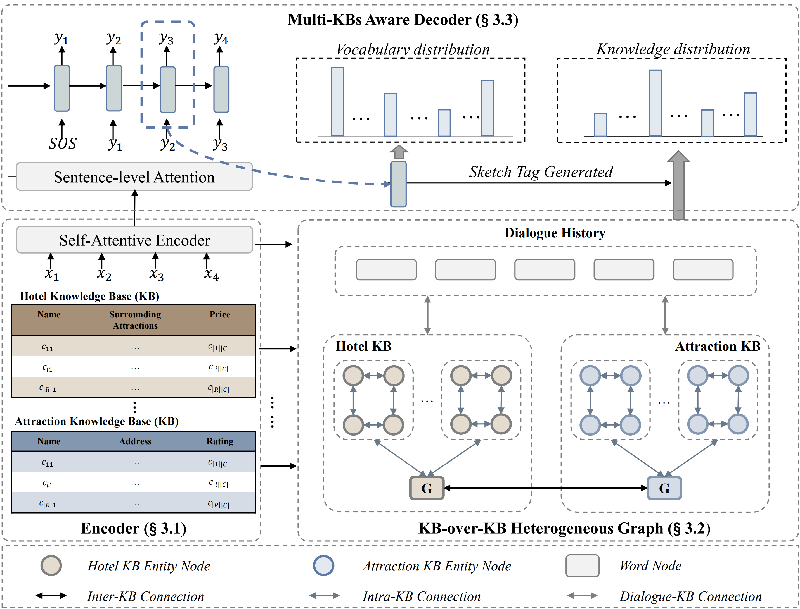

# KoK-HAN
This repository contains the PyTorch implementation of the paper: 

**Towards Complex Scenarios: Building End-to-end Task-oriented Dialogue System across Multiple Knowledge Bases**.
Libo Qin*, Zhouyang Li*, Qiying Yu, Lehan Wang, Wanxiang Che. 
***AAAI 2023***.

[PDF](https://ojs.aaai.org/index.php/AAAI/article/view/26581)

## Architecture



## Requirements
Our code relies on Python 3.8 and following libraries:
- torch==1.7.1
- cudatoolkit==10.1
- dgl==0.6.0

## Download dataset and best model

Download datasets and unzip it. Then put in the `data` folder.

[Datasets Link](https://drive.google.com/file/d/1uAFhifr4Dk33mgpx0F3XBh3wYat3Zhy8/view?usp=share_link)

## Run 
The script **train.py** acts as a main function to the project, you can run the experiments by the following commands.

Train
``` console
> python -u train.py -g -rec 1 -ds cross -ep 50 -bsz 32
> python -u train.py -g -rec 1 -ds risa -ep 50 -bsz 32
```

Test
```console
> python test.py -g -rec 1 -ds cross -path=<saved_model_path>
> python test.py -g -rec 1 -ds risa -path=<saved_model_path>
```

Due to some stochastic factors(e.g., GPU and environment), it maybe need to slightly tune the hyper-parameters using grid search to reproduce the results reported in our paper.
Here are the suggested hyper-parameter settings:
+ batch_size [16, 32]
+ dropout_rate [0.1, 0.2]
+ num_graph_layer [2, 3]

And we provide the best model saved.
Download datasets and unzip it. Then put in the `save` folder.

[Best Models Link](https://drive.google.com/file/d/1cqLDiGQWi-IdeGSzei87EJuxoVN3svWn/view?usp=sharing)  

## Citation
If you use any source codes included in this repo in your work, please cite the following paper. 
The bibtex is listed below:
```
@inproceedings{qin2023towards,
  title={Towards Complex Scenarios: Building End-to-End Task-Oriented Dialogue System across Multiple Knowledge Bases},
  author={Qin, Libo and Li, Zhouyang and Yu, Qiying and Wang, Lehan and Che, Wanxiang},
  booktitle={Proceedings of the AAAI Conference on Artificial Intelligence},
  volume={37},
  number={11},
  pages={13483--13491},
  year={2023}
}
```


## Issues/PRs/Questions 
Feel free to contact [me](mailto:zhouyangli@ir.hit.edu.cn) for any questions or create issues/PRs.

## Acknowledgements
We thank for the GNN Library [DGL](https://github.com/dmlc/dgl), the open source code of [GLMP](https://github.com/jasonwu0731/GLMP) and [DF-Net](https://github.com/LooperXX/DF-Net).